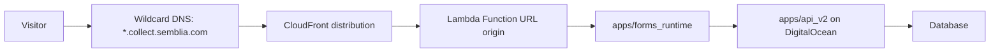

# Hosted Forms Runtime Implementation Plan

> **For agentic workers:** REQUIRED SUB-SKILL: Use superpowers:subagent-driven-development (recommended) or superpowers:executing-plans to implement this plan task-by-task. Steps use checkbox (`- [ ]`) syntax for tracking.

**Goal:** Ship public hosted collection forms at `*.collect.semblia.com` without adding steady-state load to the DigitalOcean API/worker droplet.

**Architecture:** Add a shared `packages/forms-core` package for form schema normalization, design-token mapping, live preview view models, shared React rendering, and server HTML rendering. Add a separate deployable `apps/forms_runtime` Hono app for the public form runtime, hosted behind AWS CloudFront and a serverless compute origin. Keep `apps/api_v2` on DigitalOcean as the canonical source of truth for host/form resolution, trust validation, submissions, analytics, notifications, and worker fanout.

**Tech Stack:** pnpm workspace, TypeScript, React shared renderer in `packages/forms-core`, Hono in `apps/forms_runtime`, Hono AWS Lambda adapter, Hono Node adapter for local dev, esbuild runtime bundling, AWS CDK TypeScript IaC, AWS CloudFront, AWS Lambda Node.js 22.x, ACM wildcard certificate, existing `api_v2` V2 forms/public-submit contracts, `@workspace/types`.

---

## Scaffold Status

Initial scaffold landed on 2026-05-30:

- `packages/forms-core` exists with shared config normalization, design-token CSS variables, view-model generation, React renderer, server HTML renderer, and Vitest coverage.
- `apps/forms_runtime` exists with Hono local/Lambda entrypoints, mock dev services, signed `api_v2` client plumbing, hosted host/path resolution, submit proxy shape, unit coverage, and local mock mode at `http://localhost:3007/`.
- `apps/forms_runtime/infra` contains the first CDK stack for CloudFront + Lambda Function URL + OAC, with a CloudFront Function that copies the viewer hostname into `x-semblia-original-host`.
- API-side `/v2/runtime/forms/*` endpoints and `web_v2` studio preview integration remain future tasks.

---

## Deployment Decision

Use both a shared package and a separate app. They solve different problems.

Create:

- `packages/forms-core` — shared form config schema, coercion, token-to-CSS mapping, render view model, validation helpers, React form renderer, and server HTML renderer used by both `apps/web_v2` live studio preview and `apps/forms_runtime`.
- `apps/forms_runtime` — deployable Hono public runtime for `*.collect.semblia.com`.

`packages/forms-core` must not depend on Next.js, Clerk, TanStack Query, browser-only dashboard state, or AWS runtime concerns. It exposes pure TypeScript helpers plus React renderer subpaths with React/ReactDOM as peer dependencies. Keep dashboard-only controls in `apps/web_v2`; keep routing, request signing, caching, and AWS deployment in `apps/forms_runtime`.

Do not import `apps/web_v2` from the runtime. `web_v2` is a Vercel/Next.js product client with client hooks, UI state, and app-router assumptions; the public runtime needs a smaller deployment artifact with no Clerk user-session dependency and no dashboard-only state. The shared package is the bridge.

Do not give the AWS runtime direct database access for v1. It should call `api_v2` service endpoints so all project isolation, trust semantics, idempotency, submission writes, analytics, and notifications remain owned by the existing backend.

## Stack Choice

`packages/forms-core`:

- TypeScript ESM.
- Zod for schema/coercion and validation.
- React renderer components shared by `web_v2` preview and hosted runtime output.
- `react-dom/server` wrapper for hosted HTML rendering.
- Vitest for package tests.
- No Next.js, Clerk, TanStack Query, Prisma, Redis, AWS SDK, or browser-only dashboard dependencies.
- Exports pure config, normalization, token, view-model, validation, React renderer, and server HTML-render helpers.

`apps/forms_runtime`:

- TypeScript ESM.
- Hono as the durable HTTP framework from day one.
- `hono/aws-lambda` adapter for AWS production.
- `@hono/node-server` adapter for local development.
- esbuild for a small Lambda bundle; `tsc --noEmit` remains the typecheck gate.
- Zod for env parsing and request validation.
- Depends on `@workspace/forms-core`, `@workspace/types`, `hono`, `react`, and `react-dom`.
- Does not depend on `apps/web_v2`, NestJS, Prisma, Redis, Clerk browser SDKs, or the AWS SDK for the first milestone.

AWS:

- CloudFront distribution for `*.collect.semblia.com`.
- ACM wildcard certificate in `us-east-1`.
- Lambda Node.js 22.x behind a Lambda Function URL origin.
- AWS CDK TypeScript for infrastructure from the first deployment so CloudFront, Function URL, cert wiring, log retention, and concurrency caps are not hand-built.
- CloudWatch logs with short retention and a Lambda reserved concurrency cap.
- No API Gateway, WAF, provisioned concurrency, or AWS database before the first paid-customer milestone unless a real constraint forces it.

## Public URL Contract

Initial launch contract:

```text
https://{projectPublicSlug}.collect.semblia.com/
https://{projectPublicSlug}.collect.semblia.com/{formSlug}
```

Rules:

- `*.collect.semblia.com` covers one subdomain level such as `acme.collect.semblia.com`.
- Do not require nested hostnames such as `feedback.acme.collect.semblia.com`.
- The default `/` route resolves to the project's primary published form.
- Path routes resolve to a form slug owned by the resolved project.
- Dashboard copy/open actions should use the hosted URL returned by the API, not reconstruct it in the client.

## AWS Runtime Shape

Recommended v1 path:



Why this path:

- Low idle cost before the first 10 paying customers.
- CloudFront absorbs TLS, edge caching, and static asset delivery.
- Lambda avoids another always-on container.
- Lambda Function URL avoids API Gateway cost/complexity until we need gateway-only features.
- The DO droplet only handles API cache misses, form resolution, submissions, and analytics writes.

## Runtime/API Boundary

`apps/forms_runtime` calls `apps/api_v2` through a dedicated service-to-service contract.

Environment:

```text
FORMS_RUNTIME_API_BASE_URL=https://api.semblia.com/v2
FORMS_RUNTIME_SIGNING_SECRET=...
FORMS_RUNTIME_PUBLIC_BASE_DOMAIN=collect.semblia.com
FORMS_RUNTIME_ASSET_BASE_URL=https://assets.collect.semblia.com
```

Runtime outbound requests to `api_v2` include:

```text
x-semblia-runtime: forms
x-semblia-runtime-timestamp: <unix ms>
x-semblia-runtime-signature: v1=<hmac_sha256(secret, method + "\n" + path + "\n" + timestamp + "\n" + body_sha256)>
x-semblia-original-host: <viewer host>
x-semblia-original-path: <viewer path>
```

`api_v2` verifies:

- Signature is valid.
- Timestamp is inside a short skew window.
- `x-semblia-original-host` is a configured hosted form host or project public slug.
- Resolved form is published and active.
- Submission idempotency and abuse throttling still run through the canonical public-submit code path.

## Task 1: Create The Shared Forms Package

**Files:**

- Create: `packages/forms-core/package.json`
- Create: `packages/forms-core/tsconfig.json`
- Create: `packages/forms-core/src/index.ts`
- Create: `packages/forms-core/src/types.ts`
- Create: `packages/forms-core/src/defaults.ts`
- Create: `packages/forms-core/src/normalize.ts`
- Create: `packages/forms-core/src/view-model.ts`
- Create: `packages/forms-core/src/css-vars.ts`
- Create: `packages/forms-core/src/react.tsx`
- Create: `packages/forms-core/src/server.tsx`
- Create: `packages/forms-core/src/normalize.spec.ts`
- Create: `packages/forms-core/src/view-model.spec.ts`

- [ ] **Step 1: Add the shared package manifest**

Create `packages/forms-core/package.json`:

```json
{
  "name": "@workspace/forms-core",
  "version": "0.1.0",
  "private": true,
  "type": "module",
  "main": "./dist/index.js",
  "types": "./dist/index.d.ts",
  "exports": {
    ".": {
      "types": "./dist/index.d.ts",
      "import": "./dist/index.js"
    },
    "./html": {
      "types": "./dist/server.d.ts",
      "import": "./dist/server.js"
    },
    "./react": {
      "types": "./dist/react.d.ts",
      "import": "./dist/react.js"
    }
  },
  "files": ["dist"],
  "scripts": {
    "build": "tsc -p tsconfig.json",
    "typecheck": "tsc --noEmit -p tsconfig.json",
    "test": "vitest run",
    "dev": "tsc -p tsconfig.json --watch"
  },
  "dependencies": {
    "zod": "^4.3.6"
  },
  "peerDependencies": {
    "react": "19.2.1",
    "react-dom": "19.2.1"
  },
  "devDependencies": {
    "@types/react": "^19.1.9",
    "@types/react-dom": "^19.1.7",
    "@workspace/typescript-config": "workspace:*",
    "react": "19.2.1",
    "react-dom": "19.2.1",
    "typescript": "5.7.3",
    "vitest": "^3.2.4"
  }
}
```

- [ ] **Step 2: Add TypeScript config**

Create `packages/forms-core/tsconfig.json`:

```json
{
  "extends": "@workspace/typescript-config/base.json",
  "compilerOptions": {
    "outDir": "dist",
    "rootDir": "src",
    "jsx": "react-jsx"
  },
  "include": ["src/**/*.ts"],
  "exclude": ["dist", "node_modules"]
}
```

- [ ] **Step 3: Define the shared form model**

Create `packages/forms-core/src/types.ts`:

```ts
export type FormQuestionType = "text" | "textarea" | "email" | "rating";

export interface FormQuestion {
  id: string;
  type: FormQuestionType;
  label: string;
  placeholder?: string;
  required: boolean;
}

export interface FormDesignTokens {
  accent: string;
  background: string;
  text: string;
  mutedText: string;
  surface: string;
  border: string;
  radius: number;
  fontFamily: string;
}

export interface FormConfig {
  brandName: string;
  headline: string;
  subhead: string;
  questions: FormQuestion[];
  tokens: FormDesignTokens;
}

export interface FormViewModelQuestion {
  id: string;
  type: FormQuestionType;
  label: string;
  placeholder: string;
  required: boolean;
  inputName: string;
}

export interface FormViewModel {
  brandName: string;
  headline: string;
  subhead: string;
  questions: FormViewModelQuestion[];
  cssVars: Record<string, string>;
}
```

- [ ] **Step 4: Add defaults**

Create `packages/forms-core/src/defaults.ts`:

```ts
import type { FormConfig } from "./types.js";

export const DEFAULT_FORM_CONFIG: FormConfig = {
  brandName: "Your brand",
  headline: "How was your experience?",
  subhead: "Share a few words. It helps others understand what to expect.",
  questions: [
    {
      id: "content",
      type: "textarea",
      label: "Your feedback",
      placeholder: "Tell us what stood out...",
      required: true,
    },
    {
      id: "authorName",
      type: "text",
      label: "Your name",
      placeholder: "Jane Doe",
      required: true,
    },
    {
      id: "authorEmail",
      type: "email",
      label: "Email",
      placeholder: "jane@example.com",
      required: false,
    },
    {
      id: "rating",
      type: "rating",
      label: "Rating",
      required: false,
    },
  ],
  tokens: {
    accent: "#4f46e5",
    background: "#ffffff",
    text: "#111827",
    mutedText: "#6b7280",
    surface: "#ffffff",
    border: "#d1d5db",
    radius: 14,
    fontFamily: "Inter, ui-sans-serif, system-ui, sans-serif",
  },
};
```

- [ ] **Step 5: Add config normalization**

Create `packages/forms-core/src/normalize.ts`:

```ts
import { z } from "zod";
import { DEFAULT_FORM_CONFIG } from "./defaults.js";
import type { FormConfig } from "./types.js";

const questionSchema = z.object({
  id: z.string().min(1),
  type: z.enum(["text", "textarea", "email", "rating"]),
  label: z.string().min(1),
  placeholder: z.string().optional(),
  required: z.boolean().default(false),
});

const tokenSchema = z.object({
  accent: z.string().default(DEFAULT_FORM_CONFIG.tokens.accent),
  background: z.string().default(DEFAULT_FORM_CONFIG.tokens.background),
  text: z.string().default(DEFAULT_FORM_CONFIG.tokens.text),
  mutedText: z.string().default(DEFAULT_FORM_CONFIG.tokens.mutedText),
  surface: z.string().default(DEFAULT_FORM_CONFIG.tokens.surface),
  border: z.string().default(DEFAULT_FORM_CONFIG.tokens.border),
  radius: z.coerce
    .number()
    .min(0)
    .max(40)
    .default(DEFAULT_FORM_CONFIG.tokens.radius),
  fontFamily: z.string().default(DEFAULT_FORM_CONFIG.tokens.fontFamily),
});

const formConfigSchema = z.object({
  brandName: z.string().default(DEFAULT_FORM_CONFIG.brandName),
  headline: z.string().default(DEFAULT_FORM_CONFIG.headline),
  subhead: z.string().default(DEFAULT_FORM_CONFIG.subhead),
  questions: z
    .array(questionSchema)
    .min(1)
    .default(DEFAULT_FORM_CONFIG.questions),
  tokens: tokenSchema.default(DEFAULT_FORM_CONFIG.tokens),
});

export function normalizeFormConfig(input: unknown): FormConfig {
  const parsed = formConfigSchema.safeParse(input);
  if (!parsed.success) return DEFAULT_FORM_CONFIG;
  return parsed.data;
}
```

- [ ] **Step 6: Add CSS variables and view-model builder**

Create `packages/forms-core/src/css-vars.ts`:

```ts
import type { FormDesignTokens } from "./types.js";

export function tokensToCssVars(
  tokens: FormDesignTokens,
): Record<string, string> {
  return {
    "--semblia-form-accent": tokens.accent,
    "--semblia-form-background": tokens.background,
    "--semblia-form-text": tokens.text,
    "--semblia-form-muted-text": tokens.mutedText,
    "--semblia-form-surface": tokens.surface,
    "--semblia-form-border": tokens.border,
    "--semblia-form-radius": `${tokens.radius}px`,
    "--semblia-form-font-family": tokens.fontFamily,
  };
}
```

Create `packages/forms-core/src/view-model.ts`:

```ts
import { tokensToCssVars } from "./css-vars.js";
import type { FormConfig, FormViewModel } from "./types.js";

export function createFormViewModel(config: FormConfig): FormViewModel {
  return {
    brandName: config.brandName,
    headline: config.headline,
    subhead: config.subhead,
    questions: config.questions.map((question) => ({
      id: question.id,
      type: question.type,
      label: question.label,
      placeholder: question.placeholder ?? "",
      required: question.required,
      inputName: `answers[${question.id}]`,
    })),
    cssVars: tokensToCssVars(config.tokens),
  };
}
```

- [ ] **Step 7: Add shared React and server renderers**

Create `packages/forms-core/src/react.tsx`:

```tsx
import type { CSSProperties } from "react";
import type { FormViewModel } from "./types.js";

export function HostedForm(props: {
  model: FormViewModel;
  actionPath: string;
  submitted?: boolean;
}) {
  const style = props.model.cssVars as CSSProperties;

  return (
    <main className="semblia-form" style={style}>
      <p className="semblia-form__brand">{props.model.brandName}</p>
      <h1 className="semblia-form__headline">{props.model.headline}</h1>
      <p className="semblia-form__subhead">{props.model.subhead}</p>
      {props.submitted ? (
        <p role="status">Thanks. Your response was submitted.</p>
      ) : (
        <form method="post" action={props.actionPath}>
          {props.model.questions.map((question) => (
            <label key={question.id}>
              <span>{question.label}</span>
              {question.type === "textarea" ? (
                <textarea
                  name={question.inputName}
                  placeholder={question.placeholder}
                  required={question.required}
                />
              ) : question.type === "rating" ? (
                <input
                  type="number"
                  min={1}
                  max={5}
                  name={question.inputName}
                  required={question.required}
                />
              ) : (
                <input
                  type={question.type === "email" ? "email" : "text"}
                  name={question.inputName}
                  placeholder={question.placeholder}
                  required={question.required}
                />
              )}
            </label>
          ))}
          <button type="submit">Submit</button>
        </form>
      )}
    </main>
  );
}
```

Create `packages/forms-core/src/server.tsx`:

```tsx
import { renderToStaticMarkup } from "react-dom/server";
import { HostedForm } from "./react.js";
import type { FormViewModel } from "./types.js";

export function renderHostedFormHtml(input: {
  model: FormViewModel;
  actionPath: string;
  submitted?: boolean;
}): string {
  const body = renderToStaticMarkup(
    <HostedForm
      model={input.model}
      actionPath={input.actionPath}
      submitted={input.submitted}
    />,
  );

  return `<!doctype html>
<html lang="en">
  <head>
    <meta charset="utf-8">
    <meta name="viewport" content="width=device-width, initial-scale=1">
    <title>${input.model.headline} - ${input.model.brandName}</title>
  </head>
  <body>${body}</body>
</html>`;
}
```

- [ ] **Step 8: Export the package API**

Create `packages/forms-core/src/index.ts`:

```ts
export { DEFAULT_FORM_CONFIG } from "./defaults.js";
export { normalizeFormConfig } from "./normalize.js";
export { tokensToCssVars } from "./css-vars.js";
export { createFormViewModel } from "./view-model.js";
export { HostedForm } from "./react.js";
export type {
  FormConfig,
  FormDesignTokens,
  FormQuestion,
  FormQuestionType,
  FormViewModel,
  FormViewModelQuestion,
} from "./types.js";
```

- [ ] **Step 9: Add core tests**

Create `packages/forms-core/src/normalize.spec.ts`:

```ts
import { describe, expect, it } from "vitest";
import { DEFAULT_FORM_CONFIG } from "./defaults.js";
import { normalizeFormConfig } from "./normalize.js";

describe("normalizeFormConfig", () => {
  it("returns defaults for malformed input", () => {
    expect(normalizeFormConfig(null)).toEqual(DEFAULT_FORM_CONFIG);
  });

  it("preserves valid question ids and labels", () => {
    const config = normalizeFormConfig({
      brandName: "Acme",
      headline: "Tell us",
      subhead: "One minute",
      questions: [
        {
          id: "content",
          type: "textarea",
          label: "Feedback",
          required: true,
        },
      ],
      tokens: { accent: "#000000" },
    });

    expect(config.brandName).toBe("Acme");
    expect(config.questions[0]?.id).toBe("content");
    expect(config.tokens.accent).toBe("#000000");
  });
});
```

Create `packages/forms-core/src/view-model.spec.ts`:

```ts
import { describe, expect, it } from "vitest";
import { DEFAULT_FORM_CONFIG } from "./defaults.js";
import { createFormViewModel } from "./view-model.js";

describe("createFormViewModel", () => {
  it("creates stable answer input names from question ids", () => {
    const model = createFormViewModel(DEFAULT_FORM_CONFIG);
    expect(model.questions.map((question) => question.inputName)).toContain(
      "answers[content]",
    );
  });
});
```

- [ ] **Step 10: Verify the shared package**

Run:

```bash
corepack.cmd pnpm --filter @workspace/forms-core typecheck
corepack.cmd pnpm --filter @workspace/forms-core test
corepack.cmd pnpm --filter @workspace/forms-core build
python scripts/update-indexes.py
```

Expected:

```text
Types, tests, and build pass. Index refresh completes because this task creates a package source tree.
```

## Task 2: Create The App Boundary

**Files:**

- Create: `apps/forms_runtime/package.json`
- Create: `apps/forms_runtime/tsconfig.json`
- Create: `apps/forms_runtime/src/app.ts`
- Create: `apps/forms_runtime/src/lambda.ts`
- Create: `apps/forms_runtime/src/local.ts`
- Create: `apps/forms_runtime/src/env.ts`

- [ ] **Step 1: Add the workspace app package**

Create `apps/forms_runtime/package.json`:

```json
{
  "name": "forms_runtime",
  "version": "0.1.0",
  "private": true,
  "type": "module",
  "scripts": {
    "dev": "tsx watch src/local.ts",
    "build": "pnpm run typecheck && pnpm run bundle",
    "bundle": "pnpm run bundle:lambda && pnpm run bundle:local",
    "bundle:lambda": "esbuild src/lambda.ts --bundle --platform=node --target=node22 --format=esm --outfile=dist/lambda.mjs",
    "bundle:local": "esbuild src/local.ts --bundle --platform=node --target=node22 --format=esm --outfile=dist/local.mjs",
    "start": "node dist/local.mjs",
    "typecheck": "tsc --noEmit -p tsconfig.json",
    "test": "vitest run",
    "lint": "eslint . --max-warnings=0"
  },
  "dependencies": {
    "@workspace/forms-core": "workspace:*",
    "@workspace/types": "workspace:*",
    "hono": "4.12.18",
    "react": "19.2.1",
    "react-dom": "19.2.1",
    "zod": "^4.3.6"
  },
  "devDependencies": {
    "@hono/node-server": "1.19.13",
    "@types/aws-lambda": "^8.10.149",
    "@types/node": "^20.19.9",
    "@types/react": "^19.1.9",
    "@types/react-dom": "^19.1.7",
    "@workspace/eslint-config": "workspace:*",
    "@workspace/typescript-config": "workspace:*",
    "aws-cdk": "^2.178.0",
    "aws-cdk-lib": "^2.178.0",
    "constructs": "^10.4.2",
    "esbuild": "^0.27.0",
    "eslint": "^9.39.1",
    "tsx": "^4.21.0",
    "typescript": "5.7.3",
    "vitest": "^3.2.4"
  }
}
```

- [ ] **Step 2: Add TypeScript config**

Create `apps/forms_runtime/tsconfig.json`:

```json
{
  "extends": "@workspace/typescript-config/base.json",
  "compilerOptions": {
    "outDir": "dist",
    "rootDir": "src",
    "types": ["node", "aws-lambda"],
    "jsx": "react-jsx"
  },
  "include": ["src/**/*.ts"],
  "exclude": ["dist", "node_modules"]
}
```

- [ ] **Step 3: Add the Hono app and adapters**

Create `apps/forms_runtime/src/app.ts`:

```ts
import { Hono } from "hono";
import type { FormsRuntimeEnv } from "./env.js";

export function createFormsRuntimeApp(env: FormsRuntimeEnv) {
  const app = new Hono();

  app.get("/health", (c) => c.json({ ok: true }));
  app.notFound((c) => c.text("Not found", 404));

  return app;
}
```

Create `apps/forms_runtime/src/lambda.ts`:

```ts
import { handle } from "hono/aws-lambda";
import { createFormsRuntimeApp } from "./app.js";
import { loadEnv } from "./env.js";

export const handler = handle(createFormsRuntimeApp(loadEnv(process.env)));
```

Create `apps/forms_runtime/src/local.ts`:

```ts
import { serve } from "@hono/node-server";
import { createFormsRuntimeApp } from "./app.js";
import { loadEnv } from "./env.js";

const env = loadEnv(process.env);

serve(
  {
    fetch: createFormsRuntimeApp(env).fetch,
    port: env.PORT,
  },
  () => {
    console.log(`forms_runtime listening on :${env.PORT}`);
  },
);
```

- [ ] **Step 4: Add env parsing**

Create `apps/forms_runtime/src/env.ts`:

```ts
import { z } from "zod";

const envSchema = z.object({
  PORT: z.coerce.number().int().positive().default(3007),
  FORMS_RUNTIME_API_BASE_URL: z.string().url(),
  FORMS_RUNTIME_SIGNING_SECRET: z.string().min(32),
  FORMS_RUNTIME_PUBLIC_BASE_DOMAIN: z.string().default("collect.semblia.com"),
  FORMS_RUNTIME_ASSET_BASE_URL: z.string().url().optional(),
});

export type FormsRuntimeEnv = z.infer<typeof envSchema>;

export function loadEnv(source: NodeJS.ProcessEnv): FormsRuntimeEnv {
  return envSchema.parse(source);
}
```

- [ ] **Step 5: Verify the app boundary**

Run:

```bash
corepack.cmd pnpm --filter forms_runtime typecheck
corepack.cmd pnpm --filter forms_runtime build
```

Expected:

```text
No TypeScript errors.
dist/lambda.mjs and dist/local.mjs are emitted.
```

## Task 3: Add Host And Path Resolution

**Files:**

- Create: `apps/forms_runtime/src/request-context.ts`
- Create: `apps/forms_runtime/src/request-context.spec.ts`
- Modify: `apps/forms_runtime/src/app.ts`

- [ ] **Step 1: Write request-context tests**

Create `apps/forms_runtime/src/request-context.spec.ts`:

```ts
import { describe, expect, it } from "vitest";
import { resolveRequestContext } from "./request-context.js";

describe("resolveRequestContext", () => {
  it("extracts project public slug and default path", () => {
    expect(
      resolveRequestContext({
        host: "acme.collect.semblia.com",
        url: "/",
        baseDomain: "collect.semblia.com",
      }),
    ).toEqual({
      projectPublicSlug: "acme",
      formSlug: null,
      path: "/",
    });
  });

  it("extracts form slug from a one-segment path", () => {
    expect(
      resolveRequestContext({
        host: "acme.collect.semblia.com",
        url: "/customer-feedback?utm=x",
        baseDomain: "collect.semblia.com",
      }),
    ).toEqual({
      projectPublicSlug: "acme",
      formSlug: "customer-feedback",
      path: "/customer-feedback",
    });
  });

  it("rejects non collect hosts", () => {
    expect(() =>
      resolveRequestContext({
        host: "app.semblia.com",
        url: "/",
        baseDomain: "collect.semblia.com",
      }),
    ).toThrow("Unsupported hosted form host");
  });
});
```

- [ ] **Step 2: Implement request context parsing**

Create `apps/forms_runtime/src/request-context.ts`:

```ts
export type HostedFormRequestContext = {
  projectPublicSlug: string;
  formSlug: string | null;
  path: string;
};

export function resolveRequestContext(input: {
  host: string | undefined;
  url: string | undefined;
  baseDomain: string;
}): HostedFormRequestContext {
  const host = input.host?.split(":")[0]?.toLowerCase();
  if (!host || !host.endsWith(`.${input.baseDomain}`)) {
    throw new Error("Unsupported hosted form host");
  }

  const projectPublicSlug = host.slice(
    0,
    host.length - input.baseDomain.length - 1,
  );
  if (!/^[a-z0-9][a-z0-9-]{1,61}[a-z0-9]$/.test(projectPublicSlug)) {
    throw new Error("Invalid hosted form project slug");
  }

  const parsed = new URL(input.url ?? "/", `https://${host}`);
  const path = parsed.pathname.replace(/\/+$/, "") || "/";
  const segments = path.split("/").filter(Boolean);

  return {
    projectPublicSlug,
    formSlug: segments[0] ?? null,
    path,
  };
}
```

- [ ] **Step 3: Run tests**

Run:

```bash
corepack.cmd pnpm --filter forms_runtime test -- src/request-context.spec.ts
```

Expected:

```text
3 tests pass.
```

## Task 4: Add Signed API Client

**Files:**

- Create: `apps/forms_runtime/src/api-client.ts`
- Create: `apps/forms_runtime/src/api-client.spec.ts`
- Modify: `apps/forms_runtime/src/app.ts`

- [ ] **Step 1: Add signing tests**

Create `apps/forms_runtime/src/api-client.spec.ts`:

```ts
import { describe, expect, it } from "vitest";
import { signRuntimeRequest } from "./api-client.js";

describe("signRuntimeRequest", () => {
  it("creates a v1 HMAC signature over method, path, timestamp, and body hash", () => {
    const headers = signRuntimeRequest({
      method: "POST",
      path: "/runtime/forms/resolve",
      timestamp: 1710000000000,
      body: '{"ok":true}',
      secret: "x".repeat(32),
    });

    expect(headers["x-semblia-runtime"]).toBe("forms");
    expect(headers["x-semblia-runtime-timestamp"]).toBe("1710000000000");
    expect(headers["x-semblia-runtime-signature"]).toMatch(/^v1=[a-f0-9]{64}$/);
  });
});
```

- [ ] **Step 2: Implement request signing**

Create `apps/forms_runtime/src/api-client.ts`:

```ts
import { createHash, createHmac } from "node:crypto";
import type { FormsRuntimeEnv } from "./env.js";

export function signRuntimeRequest(input: {
  method: string;
  path: string;
  timestamp: number;
  body: string;
  secret: string;
}): Record<string, string> {
  const bodyHash = createHash("sha256").update(input.body).digest("hex");
  const payload = [
    input.method.toUpperCase(),
    input.path,
    String(input.timestamp),
    bodyHash,
  ].join("\n");
  const signature = createHmac("sha256", input.secret)
    .update(payload)
    .digest("hex");

  return {
    "content-type": "application/json",
    "x-semblia-runtime": "forms",
    "x-semblia-runtime-timestamp": String(input.timestamp),
    "x-semblia-runtime-signature": `v1=${signature}`,
  };
}

export async function runtimeApiPost<TResponse>(
  env: FormsRuntimeEnv,
  path: string,
  body: unknown,
  extraHeaders: Record<string, string> = {},
): Promise<TResponse> {
  const serialized = JSON.stringify(body);
  const timestamp = Date.now();
  const headers = {
    ...signRuntimeRequest({
      method: "POST",
      path,
      timestamp,
      body: serialized,
      secret: env.FORMS_RUNTIME_SIGNING_SECRET,
    }),
    ...extraHeaders,
  };

  const response = await fetch(`${env.FORMS_RUNTIME_API_BASE_URL}${path}`, {
    method: "POST",
    headers,
    body: serialized,
  });

  if (!response.ok) {
    throw new Error(`api_v2 request failed: ${response.status}`);
  }

  return (await response.json()) as TResponse;
}
```

- [ ] **Step 3: Run tests**

Run:

```bash
corepack.cmd pnpm --filter forms_runtime test -- src/api-client.spec.ts
```

Expected:

```text
1 test passes.
```

## Task 5: Add Resolve And Shared Render Flow

**Files:**

- Modify: `apps/forms_runtime/src/app.ts`
- Modify: `packages/types/src/v2.ts` if a hosted-form DTO is missing.

- [ ] **Step 1: Define the hosted resolve DTO**

If no equivalent DTO exists, add to `packages/types/src/v2.ts`:

```ts
export interface V2HostedFormResolveDTO {
  project: {
    id: string;
    slug: string;
    name: string;
    publicSlug: string;
    brandColorPrimary: string | null;
  };
  form: {
    id: string;
    slug: string | null;
    name: string;
    description: string | null;
    config: Record<string, unknown>;
    publishedAt: string | null;
  };
}
```

- [ ] **Step 2: Wire GET requests through API resolve and `@workspace/forms-core`**

Modify `apps/forms_runtime/src/app.ts` so hosted form `GET` requests resolve through `api_v2` and render through the shared React renderer:

```ts
import {
  createFormViewModel,
  normalizeFormConfig,
} from "@workspace/forms-core";
import { renderHostedFormHtml } from "@workspace/forms-core/html";
import type { V2HostedFormResolveDTO } from "@workspace/types";
import { Hono } from "hono";
import type { FormsRuntimeEnv } from "./env.js";
import { runtimeApiPost } from "./api-client.js";
import { resolveRequestContext } from "./request-context.js";

export function createFormsRuntimeApp(env: FormsRuntimeEnv) {
  const app = new Hono();

  app.get("/health", (c) => c.json({ ok: true }));

  app.get("*", async (c) => {
    const url = new URL(c.req.url);
    const host = c.req.header("host");

    const context = resolveRequestContext({
      host,
      url: `${url.pathname}${url.search}`,
      baseDomain: env.FORMS_RUNTIME_PUBLIC_BASE_DOMAIN,
    });

    const resolved = await runtimeApiPost<V2HostedFormResolveDTO>(
      env,
      "/runtime/forms/resolve",
      context,
      {
        "x-semblia-original-host": host ?? "",
        "x-semblia-original-path": context.path,
      },
    );

    const model = createFormViewModel(
      normalizeFormConfig(resolved.form.config),
    );
    const html = renderHostedFormHtml({
      model: {
        ...model,
        brandName: model.brandName || resolved.project.name,
      },
      actionPath: "/__submit",
    });

    return c.html(html, 200, {
      "cache-control": "public, s-maxage=60, stale-while-revalidate=300",
    });
  });

  app.notFound((c) => c.text("Not found", 404));

  return app;
}
```

- [ ] **Step 3: Verify runtime and shared package integration**

Run:

```bash
corepack.cmd pnpm --filter @workspace/forms-core build
corepack.cmd pnpm --filter forms_runtime typecheck
corepack.cmd pnpm --filter forms_runtime test
corepack.cmd pnpm --filter forms_runtime build
```

Expected:

```text
The forms runtime imports the shared package successfully, and all runtime checks pass.
```

## Task 6: Add Submission Proxy

**Files:**

- Modify: `apps/forms_runtime/src/app.ts`

- [ ] **Step 1: Forward POST submissions through Hono**

Modify `apps/forms_runtime/src/app.ts` so `POST /__submit` reads the form body, applies a hard body-size cap, and forwards to `api_v2`:

```ts
app.post("/__submit", async (c) => {
  const url = new URL(c.req.url);
  const host = c.req.header("host");
  const context = resolveRequestContext({
    host,
    url: `${url.pathname}${url.search}`,
    baseDomain: env.FORMS_RUNTIME_PUBLIC_BASE_DOMAIN,
  });

  const body = await c.req.text();
  if (new TextEncoder().encode(body).byteLength > 64 * 1024) {
    return c.text("Request body too large", 413);
  }

  const result = await runtimeApiPost<{ redirectTo: string | null }>(
    env,
    "/runtime/forms/submit",
    {
      context,
      contentType: c.req.header("content-type") ?? "",
      body,
    },
    {
      "x-semblia-original-host": host ?? "",
      "x-semblia-original-path": context.path,
    },
  );

  return c.redirect(result.redirectTo ?? "/?submitted=1", 303);
});
```

- [ ] **Step 2: Keep canonical submit behavior in `api_v2`**

The API-side implementation must reuse existing form submission semantics:

```text
CollectionFormSubmission is written by api_v2.
Public submit idempotency stays surface-scoped.
Trust mode is first-party-hosted-runtime, verified by runtime HMAC.
Notifications and analytics are emitted by api_v2/worker paths.
```

## Task 7: Add API Runtime Endpoints

**Files:**

- Modify: `apps/api_v2/src/modules/forms/forms.dto.ts`
- Modify: `apps/api_v2/src/modules/forms/forms.controller.ts`
- Modify: `apps/api_v2/src/modules/forms/forms.service.ts`
- Modify: `apps/api_v2/src/modules/forms/forms.service.spec.ts`
- Modify: `apps/api_v2/src/modules/forms/forms.spec.ts`
- Modify: `apps/api_v2/src/config/env.ts` or the current env-validation file if runtime secrets are validated elsewhere.
- Modify: `packages/types/src/v2.ts`

- [ ] **Step 1: Add API DTOs**

Add request/response schemas for:

```ts
export interface V2HostedFormResolveRequestDTO {
  projectPublicSlug: string;
  formSlug: string | null;
  path: string;
}

export interface V2HostedFormSubmitRequestDTO {
  context: V2HostedFormResolveRequestDTO;
  contentType: string;
  body: string;
}

export interface V2HostedFormSubmitResponseDTO {
  redirectTo: string | null;
}
```

- [ ] **Step 2: Add runtime signature verification**

The controller or guard must verify:

```text
x-semblia-runtime === "forms"
x-semblia-runtime-timestamp is present and within the configured skew window
x-semblia-runtime-signature matches the HMAC over method, path, timestamp, and body hash
```

Rejected runtime signatures return `401`.

- [ ] **Step 3: Add resolve endpoint**

Add:

```text
POST /v2/runtime/forms/resolve
```

Behavior:

```text
Input: projectPublicSlug + formSlug/path from forms_runtime.
Resolve project by hosted public slug.
Resolve default form for "/" or form by form slug.
Reject inactive/unpublished forms with 404.
Return only display-safe project/form data needed to render the public page.
```

- [ ] **Step 4: Add submit endpoint**

Add:

```text
POST /v2/runtime/forms/submit
```

Behavior:

```text
Verify runtime signature.
Resolve the same project/form as the render path.
Parse the submitted form body.
Call the existing canonical form submission path so CollectionFormSubmission remains the source record.
Apply surface-scoped idempotency.
Emit analytics/notification side effects through existing api_v2 services.
Return a redirect destination or null.
```

- [ ] **Step 5: Add API tests**

Cover:

```text
resolve rejects bad signatures
resolve returns a published default form
resolve returns a published slugged form
resolve rejects inactive/unpublished forms
submit rejects bad signatures
submit writes CollectionFormSubmission through the canonical path
submit preserves idempotency behavior
```

- [ ] **Step 6: Verify API changes**

Run:

```bash
corepack.cmd pnpm --filter @workspace/types build
corepack.cmd pnpm --filter api_v2 typecheck
corepack.cmd pnpm --filter api_v2 lint
corepack.cmd pnpm --filter api_v2 test -- --run modules/forms
pnpm.cmd build --filter api_v2
python scripts/update-indexes.py
```

Expected:

```text
Types build, API typecheck/lint/tests/build pass, and indexes refresh successfully.
```

## Task 8: Add AWS Deployment Artifacts

**Files:**

- Create: `apps/forms_runtime/cdk.json`
- Create: `apps/forms_runtime/infra/forms-runtime-stack.ts`
- Create: `apps/forms_runtime/deploy/README.md`
- Create: `apps/forms_runtime/deploy/cloudfront-notes.md`

- [ ] **Step 1: Add CDK app config**

Create `apps/forms_runtime/cdk.json`:

```json
{
  "app": "tsx infra/forms-runtime-stack.ts",
  "context": {
    "formsRuntimeDomain": "*.collect.semblia.com"
  }
}
```

- [ ] **Step 2: Add the CDK stack skeleton**

Create `apps/forms_runtime/infra/forms-runtime-stack.ts`:

```ts
import * as cdk from "aws-cdk-lib";
import * as cloudfront from "aws-cdk-lib/aws-cloudfront";
import * as origins from "aws-cdk-lib/aws-cloudfront-origins";
import * as lambda from "aws-cdk-lib/aws-lambda";
import { NodejsFunction } from "aws-cdk-lib/aws-lambda-nodejs";
import { Construct } from "constructs";

export class FormsRuntimeStack extends cdk.Stack {
  constructor(scope: Construct, id: string, props?: cdk.StackProps) {
    super(scope, id, props);

    const fn = new NodejsFunction(this, "FormsRuntimeLambda", {
      entry: "src/lambda.ts",
      handler: "handler",
      runtime: lambda.Runtime.NODEJS_22_X,
      memorySize: 256,
      timeout: cdk.Duration.seconds(10),
      reservedConcurrentExecutions: 20,
    });

    const fnUrl = fn.addFunctionUrl({
      authType: lambda.FunctionUrlAuthType.AWS_IAM,
    });

    new cloudfront.Distribution(this, "FormsRuntimeDistribution", {
      defaultBehavior: {
        origin: origins.FunctionUrlOrigin.withOriginAccessControl(fnUrl),
      },
    });
  }
}

const app = new cdk.App();
new FormsRuntimeStack(app, "FormsRuntimeStack", {
  env: {
    region: process.env.AWS_REGION ?? "us-east-1",
  },
});
```

- [ ] **Step 3: Document AWS resources**

Create `apps/forms_runtime/deploy/README.md`:

```md
# forms_runtime deployment

Resources:

- ACM certificate in `us-east-1` for `*.collect.semblia.com`
- CloudFront distribution with wildcard alternate domain `*.collect.semblia.com`
- Lambda Function URL origin for `forms_runtime`
- DNS wildcard CNAME from `*.collect.semblia.com` to the CloudFront distribution
- CloudWatch log group with 7 day retention
- AWS budget alarm and Lambda reserved concurrency cap

Do not add API Gateway, WAF, provisioned concurrency, or an AWS database before the first paid-customer milestone unless a real constraint forces it.
```

- [ ] **Step 4: Document cache policy**

Create `apps/forms_runtime/deploy/cloudfront-notes.md`:

```md
# CloudFront policy

GET/HEAD HTML:

- Cache-Control from origin: `public, s-maxage=60, stale-while-revalidate=300`
- Forward Host header or inject `x-semblia-original-host`
- Forward query string only for known preview/debug parameters if needed

POST `/__submit`:

- Do not cache
- Forward request body
- Forward `content-type`, `user-agent`, and viewer IP headers available from CloudFront

Static assets:

- Content-hashed filenames
- Long immutable cache
```

## Task 9: Dashboard Integration

**Files:**

- Modify: `apps/web_v2/components/collect/form-config-list.tsx`
- Modify: `apps/web_v2/components/collect/form-item-card.tsx`
- Modify: `apps/web_v2/lib/collect/studio-draft-context.tsx`
- Modify: `apps/web_v2/lib/collect/dto-adapter.ts`
- Modify: `apps/web_v2/components/collect/studio/studio-preview.tsx`
- Modify: `apps/web_v2/lib/collect/studio-types.ts`
- Modify: `packages/types/src/v2.ts`
- Modify: `packages/forms-core/src/*`
- Modify: `apps/api_v2/src/modules/forms/forms.service.ts`

- [ ] **Step 1: Add hosted URL to form DTO**

Extend form DTOs with:

```ts
hostedUrl: string | null;
publicSlug: string | null;
publishedAt: string | null;
hasUnpublishedDraft: boolean;
```

- [ ] **Step 2: Render copy/open actions from API data**

Use the API-provided `hostedUrl` directly. Do not reconstruct `*.collect.semblia.com` in `web_v2`.

- [ ] **Step 3: Keep draft and publish state separate**

The form studio edits server drafts. Hosted pages render only published form config. The UI must show when a draft differs from published config.

- [ ] **Step 4: Move collect studio preview data through `@workspace/forms-core`**

Use the shared package for live preview normalization:

```ts
import {
  createFormViewModel,
  normalizeFormConfig,
} from "@workspace/forms-core";

const model = createFormViewModel(normalizeFormConfig(draft));
```

The studio can keep dashboard-only editor controls in `apps/web_v2`, but the preview surface must consume the shared `FormViewModel`. This keeps the hosted page and the live editor preview on the same config, field naming, token, and fallback rules.

## Verification Gates

After source changes in `packages/forms-core`:

```bash
corepack.cmd pnpm --filter @workspace/forms-core typecheck
corepack.cmd pnpm --filter @workspace/forms-core test
corepack.cmd pnpm --filter @workspace/forms-core build
python scripts/update-indexes.py
```

After source changes in `apps/forms_runtime`:

```bash
corepack.cmd pnpm --filter @workspace/forms-core build
corepack.cmd pnpm --filter forms_runtime typecheck
corepack.cmd pnpm --filter forms_runtime lint
corepack.cmd pnpm --filter forms_runtime test
corepack.cmd pnpm --filter forms_runtime build
```

After changes in `apps/api_v2`, `apps/web_v2`, or `packages`:

```bash
python scripts/update-indexes.py
```

For `apps/api_v2` changes:

```bash
corepack.cmd pnpm --filter api_v2 typecheck
corepack.cmd pnpm --filter api_v2 lint
corepack.cmd pnpm --filter api_v2 test -- --run modules/forms
pnpm.cmd build --filter api_v2
```

For `apps/web_v2` changes:

```bash
cd apps/web_v2 && pnpm.cmd exec tsc --noEmit
cd apps/web_v2 && pnpm.cmd exec eslint . --ext .ts,.tsx
pnpm.cmd --filter web_v2 test -- tests/collect
pnpm.cmd build --filter web_v2
```

## Cost Guardrails Before 10 Paying Customers

- Lambda reserved concurrency cap.
- CloudWatch log retention: 7 days.
- AWS budget alarm at a low fixed amount.
- No provisioned concurrency.
- No API Gateway unless Lambda Function URL becomes insufficient.
- No WAF until abuse is real enough to justify fixed cost.
- No separate AWS database.
- No cross-cloud Redis dependency for the runtime.

## Open Decisions

- Whether form publish/version state already exists in the current schema or needs a small schema migration.
- Whether preview URLs should be signed API-backed preview routes or local dashboard-only previews. Default to dashboard-only local preview until public preview links are explicitly needed.

## Self-Review

- Spec coverage: This plan covers the required shared forms package, separate AWS hosting, wildcard hosted forms, cost constraints before 10 paying customers, app-vs-package boundary, API ownership, dashboard integration, and verification.
- Placeholder scan: No implementation step uses TBD/TODO wording as a substitute for required behavior.
- Type consistency: Shared `FormConfig`/`FormViewModel`, runtime env, request context, signing helpers, and hosted resolve DTO names are stable across tasks.
